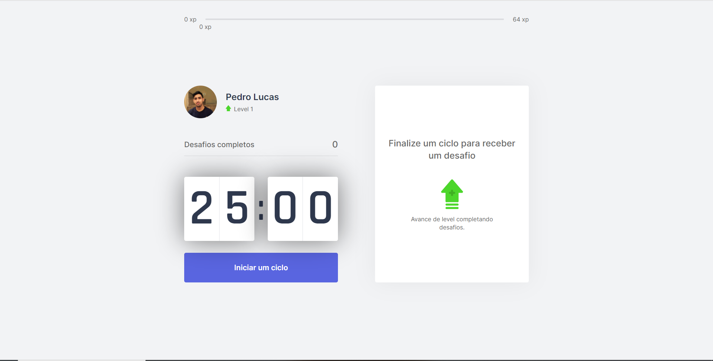

# <h1 align="center"></h1>

# Sobre

Aplicação construída na Next Level Week 4 da <a href="https://rocketseat.com.br/">Rocketseat</a>

    Utilize o método de pomodoro para ser mais produtivo e cuidar da sua saúde.
    Moveit tem a ideia de gerenciar seu tempo em um dispositivo, dividindo o trabalho
    em 25 minutos, no fim desse tempo um exercício é liberado, seja ele para o
    corpo ou para os olhos, ao completar o usuário recebe pontos de experiência(xp)
    referentes ao desafio, podendo passar de level com os pontos.

    Layout original da aplicação: 
    <a href="https://www.figma.com/file/E6eVphfc7xchrB1FNG61zI/Move.it-1.0-(Copy)">Clique aqui</a>

# 🚀 Tecnologias

<ul>
    <li>ReactJS</li>
    <li>NextJS</li>
    <li>TypeScript</li>
    <li>Server Side Rendering</li>
</ul>

# Instalação

<strong>
    Necessário ter o <a href="https://nodejs.org/en/">Node.js</a> instalado,
    um instalador de pacotes: <a href="https://www.npmjs.com/">Npm</a> ou <a href="https://yarnpkg.com/">Yarn</a>,
    para clonar o repositório use o <a href="https://git-scm.com/">Git</a>
</strong>

<pre>
# Clone o repositório
git clone https://github.com/pdrolucasz/moveit-nlw4.git

# Instale as dependências
yarn ou npm install

# Inicie a aplicação
yarn dev ou npm run dev
</pre>

#

<h3 align="center">Made with 💜 by <a href="https://www.linkedin.com/in/pedro-lucas-4b2941199/">Pedro Lucas</a></h3>
